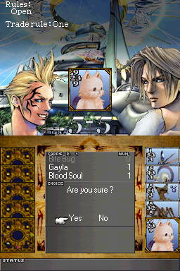

# Triple Triad DS

Triple Triad is a minigame included in Final Fantasy VIII. Triple Triad DS is a
remake of this game for the Nintendo DS developed by Minoru and originally
published in [Dev-fr.org](https://web.archive.org/web/20081205043935/http://www.dev-fr.org/index.php/topic,3778.0.html).

 
 


## Introduction (by Mineru)

This is a game played on a 3x3 board with five cards. Each card has four values:
one on each side.  Players take turns playing a card, and if the value of the
card played is higher than the value of an adjacent card, they turn over that
card. The player who turned over the most cards wins the game and takes one or
more cards from their opponent. There are other rules that add spice to the
games.

I won't dwell on the rules, there are dozens of websites that will explain them
better than me.

There is one small change: The Combo rule is decoupled from the Identical and
Plus rules. You can have Identical without Combo (but not the other way
around...). This allows you to have more combinations of rules.

The game includes an adventure mode (solo) to play against several opponents
(each with different rules), and a WiFi mode to play with your friends.

Saves are automatic and the 33 rare cards are never definitively lost! Challenge
the opponent who took them from you again to try to get them back, even after
turning off the DS! You can see in the Collection menu who has the rare cards
you lost.

**Note**: The WiFi mode isn't functional in the port to BlocksDS due to it
requiring a library that no longer works (liblobby).

### Rare cards

There are 3 levels of rare cards (8, 9 and 10) and they are of course all in the
possession of the opponents. However, opponents don't play them all from the
beginning. For example, the first opponent, Zell, will only play his level 8
rare cards at the beginning. Then, when you have unlocked other opponents, he
will play the other levels of rare cards. The same goes if you lose a rare card:
if the opponent doesn't play it, try to unlock others.

### Unloking opponents

There are 2 conditions to unlock opponents. Each opponent has one of the
following rules to be unlocked:

- You must take a certain rare card from the opponent..
- You must win a certain number of games against the opponent.

### Additional information

The game runs on emulators, but you will require an emulator that emulates DLDI
or the SD slot of the DSi to save data. If you're running on a flashcard you
will need to ensure that your loader patches the ROM with DLDI, and that it can
provide argv. On DSi, you will only need a loader that supports argv.

Essentially, if the game doesn't boot with your loader, try using the
[NDS Homebew Menu](https://github.com/devkitPro/nds-hb-menu/releases/). Get the
`BOOT.NDS` file from the compressed archive and load that from your loader.
Then, load Triple Triad DS from there.

PS: There is a cheat code that gives access to a hidden character in Wifi mode!
It is a G-Force! In the character selection menu, just spell out their name to
select it!

## Change log :

- v250112:

  - Game ported to BlocksDS.
  - EFS removed in favour of NitroFS.
  - Save data files are now saved to the root of the SD card.
  - WiFi mode removed because liblobby is no longer available or functional.

- 1.0 Finale:

  - More bug fixes...
  - AI reduced for the first 2 opponents and increased for the others

- 1.0 beta2:

  - Fixed several bugs...
  - Added English support
  - Added music

- 1.0 beta:

  - First version of the game

## Build instructions

1. Install [BlocksDS](https://blocksds.skylyrac.net/docs/).

2. Install [PAlib](https://github.com/AntonioND/palib):

   ```bash
   wf-pacman -Sy blocksds-palib
   ```

3. Clone this repository and run the following command in the root:

   ```bash
   make -j`nproc`
   ```

## Credits

- Triple Triad is a minigame included in Final Fantasy VIII by Square.
- Triple Triad DS was originally developed by Minoru.
- The original mirror of the source code was lost, and it has been obtained from
  the [GameBrew wiki](https://www.gamebrew.org/wiki/Triple_Triad_DS).
